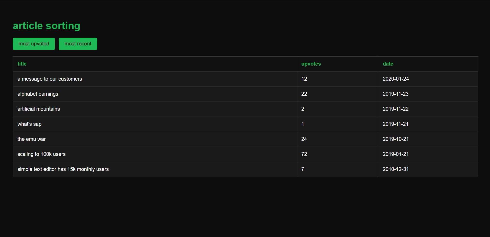

# article sorting (react)
a small react application that displays a list of articles and allows sorting by the most upvoted or the most recent. the ui uses a dark theme with hackerank-style green accents.

---

## preview:



---

## what this app does?

the app receives an array of article objects. each article includes:

- **title** (string)
- **upvotes** (number)
- **date** (string, format: yyyy-mm-dd)

---

## requirements:

- default sorting → by **upvotes** (high to low)
- **most upvoted** button → sort by upvotes
- **most recent** button → sort by latest date
- assume unique upvote counts and unique dates

---

## features:

- clean table view of articles
- two sorting options
- minimal react state handling
- dark theme ui in hackerank green
- beginner friendly component structure

---

## project structure:

```txt
.
├── src
│   ├── App.js
│   ├── Articles.js
│   ├── Data.js
│   └── style.css
├── public
│   └── index.html
├── output
│   └── article-sorting-output.png
├── package.json
└── README.md
```

---

## how to run?

```sh
git clone https://github.com/your-username/react-article-sorting-app.git
cd react-article-sorting-app
npm install
npm start
```

## open in browser:  
`http://localhost:3000`

---
## tech stack

- react  
- javascript  
- css  

---

## notes

-> simple project to practice sorting logic, state updates and list rendering in react.

---
## license

MIT  
author: **haripriyatripathi**

